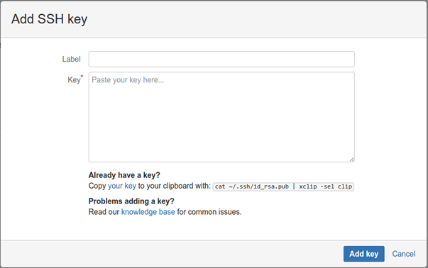

# README #

This repository contains an R package template supporting the use of the Rcpp and/or RcppArmadillo packages. The following walkthrough assumes you have [RStudio](https://www.rstudio.com/) installed. To make full use of RStudio, the [devtools](https://cran.r-project.org/web/packages/devtools/index.html) R package should also be installed. The package also includes `C++` code, and a [suitable compiler](https://cran.r-project.org/doc/manuals/r-release/R-admin.html) must be available to build the package from source.

## RStudio, Git, and SSH Keys

The R package source code is stored in a git repository, which is accessible using the ssh (__s__ecure __sh__ell) protocol. Connecting to a remote git repository requires a git client to be installed on your system. To establish if RStudio has recognized your git installation, click on the `Tools` menu and select `Global Options...` (this dialog may load slowly the first time it is opened), then click on `Git/SVN` in the left panel.

If your `Git executable:` is shown as `(Not Found)`, you probably need to install a git client; for instructions click [here](https://www.atlassian.com/git/tutorials/install-git) (or just google it).

Once RStudio has recognized your git installation, check to see if it has found a `SSH RSA Key`. 

1. If a key has not been found, make one by selecting `Create RSA Key...`. Using a passphrase is more secure, albeit less convenient.  

- If a key has been found and it is the one you want to use, nothing needs to be done.
    
- If a key has been found and it is not the one you want to use, complain to RStudio, because as far as I can tell it cannot be changed by the user. In Linux a workaround is to set the environment variable `GIT_SSH_COMMAND='ssh -i /path/to/alternate/key/id_rsa'` before running RStudio, overriding the default key selection.

The RSA public key will be used to identify and authenticate you when connecting to the git host via ssh. In cases 1 and 2 above, you can access this file by clicking `View public key`. This key must be registered with the git host, so you may want to copy and paste it into a temporary text file.

In case 3 above, it is assumed that anyone using something other than the default knows how to find the appropriate public key.

## Registering your public key with bitbucket

To register your public key, login into bitbucket and click on your avatar, which is located in the top right corner and defaults to the image . From there, select `Bitbucket settings`, and then click on `SSH Keys` in the left panel.

Next, click on `Add key`, and paste the public key from before into the text box. It is recommended to label your SSH keys, particularly when using more than one. Press the `Add key` button when finished.

